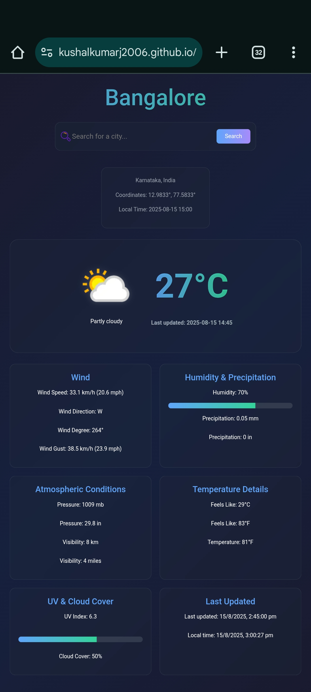

# 🌦️ CloudCtrl Weather App

A modern, responsive weather application that delivers **real-time weather updates** for any city using [WeatherAPI.com](https://www.weatherapi.com/).  
Built for the **CloudCtrl Mini Project Challenge** — combines clean UI, useful features, and smooth animations.

---

## 🎥 Demo Video
📽 **Watch here:** [Demo Video Link](https://github.com/kushalkumarj2006/Weather_APP/raw/refs/heads/main/Demo.mp4) 
## 🌐 Live Demo
🚀 **Try it here:**
🚀 **Try it here:**
<a href="https://kushalkumarj2006.github.io/Weather_APP/">
  
</a>

---

## 📌 Features
- **Search any city** and get instant weather updates.
- Displays:
  - 🌡 **Temperature** (°C & °F)  
  - ☁ **Condition** with icons  
  - 🌬 **Wind speed**, direction, degree, gust  
  - 💧 **Humidity** with progress bar  
  - 🌧 **Precipitation** (mm & inches)  
  - 📊 **Pressure** (mb & inches)  
  - 👀 **Visibility** (km & miles)  
  - 🥶 **Feels like** temperature (°C & °F)  
  - ☀ **UV index** with visual bar  
  - 🌥 **Cloud cover percentage**  
  - 🕒 **Local time & coordinates**
- **Loading spinner** while fetching data.
- **Responsive design** with mobile-friendly layout.
- Clean, modern **Bootstrap 5** styling.

---

## 🖼 Screenshots


---

## ⚙️ Installation & Setup

### 1️⃣ Clone the Repository
```bash
git clone https://github.com/kushalkumarj2006/Weather_APP.git
cd Weather_APP
````

### 2️⃣ Get Your API Key

* Sign up at [WeatherAPI.com](https://www.weatherapi.com/).
* Copy your API key.

### 3️⃣ Add API Key to `main.js`

```javascript
const APIKEY = "YOUR_API_KEY_HERE";
```

### 4️⃣ Run the App

* Open `index.html` in your browser.

---

## 📂 Project Structure

```
weather-app/
│
├── index.html       # Main HTML structure
├── style.css        # App styling
└── main.js          # Fetching & displaying weather data
```

---

## 💻 Full Source Code

### 📄 index.html

```html
<!DOCTYPE html>
<html lang="en">
<head>
    <meta charset="UTF-8">
    <meta name="viewport" content="width=device-width, initial-scale=1.0">
    <title>Weather App</title>
    <link rel="stylesheet" href="https://cdn.jsdelivr.net/npm/bootstrap@5.2.3/dist/css/bootstrap.min.css">
    <link rel="stylesheet" href="https://cdnjs.cloudflare.com/ajax/libs/font-awesome/6.2.1/css/all.min.css">
    <link rel="stylesheet" href="style.css">
</head>
<body>
    <div class="container">
        <header>
            <h1 id="cityName">Weather App</h1>
            <form id="searchForm">
                <div class="search-container">
                    <input type="text" id="cityInput" placeholder="Search for a city...">
                    <button type="submit">Search</button>
                </div>
            </form>
            <p id="error" class="error"></p>
        </header>
        <div id="loading" class="loading hidden">
            <div class="spinner"></div>
        </div>
        <div id="weatherInfo" class="weather-info hidden">
            <div class="location-info">
                <div class="location-details">
                    <p id="region"></p>
                    <p id="coordinates"></p>
                    <p id="localTime"></p>
                </div>
            </div>
            <div class="main-weather">
                <div class="weather-icon">
                    
                    <p id="weatherCondition"></p>
                </div>
                <div class="temperature">
                    <p id="temp"></p>
                    <p id="lastUpdated" class="last-updated"></p>
                </div>
            </div>
            <div class="weather-stats">
                <div class="stat-card">
                    <h3>Wind</h3>
                    <div class="wind-details">
                        <p id="wind"></p>
                        <p id="windDir"></p>
                        <p id="windDegree"></p>
                        <p id="gustSpeed"></p>
                    </div>
                </div>
                <div class="stat-card">
                    <h3>Humidity & Precipitation</h3>
                    <p id="humidity"></p>
                    <div class="humidity-bar">
                        <div id="humidityLevel"></div>
                    </div>
                    <div class="precip-details">
                        <p id="precipitation"></p>
                        <p id="precipIn"></p>
                    </div>
                </div>
                <div class="stat-card">
                    <h3>Atmospheric Conditions</h3>
                    <div class="atmospheric-details">
                        <p id="pressure"></p>
                        <p id="pressureIn"></p>
                        <p id="visibility"></p>
                        <p id="visibilityMiles"></p>
                    </div>
                </div>
                <div class="stat-card">
                    <h3>Temperature Details</h3>
                    <div class="temp-details">
                        <p id="feelsLike"></p>
                        <p id="feelsLikeF"></p>
                        <p id="tempF"></p>
                    </div>
                </div>
            </div>
            <div class="additional-stats">
                <div class="stat-card">
                    <h3>UV & Cloud Cover</h3>
                    <div class="uv-details">
                        <p id="uvIndex"></p>
                        <div class="uv-bar">
                            <div id="uvLevel"></div>
                        </div>
                        <p id="cloudCover"></p>
                    </div>
                </div>
                <div class="stat-card">
                    <h3>Last Updated</h3>
                    <div class="update-details">
                        <p id="lastUpdatedEpoch"></p>
                        <p id="localTimeEpoch"></p>
                    </div>
                </div>
            </div>
        </div>
    </div>
    <script src="https://cdn.jsdelivr.net/npm/bootstrap@5.2.3/dist/js/bootstrap.bundle.min.js"></script>
    <script src="main.js"></script>
</body>
</html>
```

### 🎨 style.css

```css
body {
  font-family: "Segoe UI", Tahoma, Geneva, Verdana, sans-serif;
  background: linear-gradient(135deg, #1a1a2e, #16213e, #1a1a2e);
  color: #ffffff;
  min-height: 100vh;
  padding: 2rem 1rem;
  line-height: 1.6;
}
.container {
  max-width: 1200px;
  margin: 0 auto;
}
header {
  text-align: center;
  margin-bottom: 3rem;
}
h1 {
  font-size: 4rem;
  margin-bottom: 2rem;
  background: linear-gradient(to right, #60a5fa, #34d399);
  -webkit-background-clip: text;
  background-clip: text;
  color: transparent;
  text-shadow: 0 2px 4px rgba(0, 0, 0, 0.1);
}
.search-container {
  position: relative;
  max-width: 36rem;
  margin: 0 auto;
  display: flex;
  align-items: center;
}
#cityInput {
  width: 100%;
  padding: 1.5rem 4rem 1.5rem 3rem;
  background: rgba(31, 41, 55, 0.3);
  border: 1px solid rgba(75, 85, 99, 0.5);
  border-radius: 1rem;
  color: #ffffff;
  font-size: 1.25rem;
  backdrop-filter: blur(8px);
  transition: all 0.3s ease;
  background-image: url("https://cdn-icons-png.flaticon.com/256/14910/14910683.png");
  background-position: 15px center;
  background-size: 30px 30px;
  background-repeat: no-repeat;
}
#cityInput:focus {
  outline: none;
  border-color: #60a5fa;
  box-shadow: 0 0 0 3px rgba(96, 165, 250, 0.2);
}
button {
  position: absolute;
  right: 1rem;
  top: 50%;
  transform: translateY(-50%);
  background: linear-gradient(to right, #60a5fa, #a78bfa);
  border: none;
  color: white;
  padding: 0.5rem 1.5rem;
  border-radius: 0.5rem;
  cursor: pointer;
  transition: all 0.3s ease;
}
button:hover {
  opacity: 0.9;
  transform: translateY(-50%) scale(1.05);
}
.error {
  color: #ef4444;
  margin-top: 0.75rem;
  font-weight: 500;
}
.loading {
  display: flex;
  justify-content: center;
  align-items: center;
  height: 16rem;
}
.spinner {
  width: 3rem;
  height: 3rem;
  border: 4px solid #60a5fa;
  border-top: 4px solid transparent;
  border-radius: 50%;
  animation: spin 1s linear infinite;
}
.weather-info {
  text-align: center;
}
.location-info {
  margin-bottom: 2rem;
  color: #9ca3af;
  display: flex;
  justify-content: center;
  gap: 2rem;
  flex-wrap: wrap;
}
.location-details {
  background: rgba(31, 41, 55, 0.3);
  padding: 1.5rem 2.5rem;
  border-radius: 1rem;
  border: 1px solid rgba(75, 85, 99, 0.5);
  backdrop-filter: blur(8px);
}
.main-weather {
  background: rgba(31, 41, 55, 0.3);
  padding: 3.5rem 2.5rem;
  border-radius: 1.5rem;
  border: 1px solid rgba(75, 85, 99, 0.5);
  margin-bottom: 2rem;
  backdrop-filter: blur(8px);
  display: flex;
  justify-content: center;
  align-items: center;
  gap: 3rem;
  flex-wrap: wrap;
}
.weather-icon {
  text-align: center;
}
.weather-icon img {
  width: 10rem;
  height: 10rem;
  filter: drop-shadow(0 0 8px rgba(255, 255, 255, 0.2));
}
.temperature {
  font-size: 6rem;
  font-weight: bold;
  background: linear-gradient(to right, #60a5fa, #34d399);
  -webkit-background-clip: text;
  background-clip: text;
  color: transparent;
  text-shadow: 0 2px 4px rgba(0, 0, 0, 0.1);
}
.last-updated {
  font-size: 1rem;
  color: #9ca3af;
  margin-top: 0.5rem;
}
.weather-stats,
.additional-stats {
  display: grid;
  grid-template-columns: repeat(auto-fit, minmax(280px, 1fr));
  gap: 1.5rem;
  margin-bottom: 1.5rem;
}
.stat-card {
  background: rgba(31, 41, 55, 0.3);
  padding: 1.5rem;
  border-radius: 1rem;
  border: 1px solid rgba(75, 85, 99, 0.5);
  backdrop-filter: blur(8px);
  transition: transform 0.3s ease;
}
.stat-card:hover {
  transform: translateY(-5px);
}
.stat-card h3 {
  color: #60a5fa;
  margin-bottom: 1rem;
  font-size: 1.5rem;
}
.humidity-bar,
.uv-bar {
  height: 1rem;
  background: rgba(75, 85, 99, 0.5);
  border-radius: 1rem;
  overflow: hidden;
  margin: 1rem 0;
}
#humidityLevel,
#uvLevel {
  height: 100%;
  background: linear-gradient(to right, #60a5fa, #34d399);
  transition: width 0.5s ease;
}
.wind-details,
.precip-details,
.atmospheric-details,
.temp-details,
.uv-details,
.update-details {
  display: grid;
  gap: 0.75rem;
}
.hidden {
  display: none;
}
@keyframes spin {
  to {
    transform: rotate(360deg);
  }
}
@media (max-width: 768px) {
  .weather-stats,
  .additional-stats {
    grid-template-columns: 1fr;
  }
  h1 {
    font-size: 3rem;
  }
  .main-weather {
    padding: 2.5rem 1.5rem;
  }
  .temperature {
    font-size: 5rem;
  }
}
```

### ⚡ main.js

```javascript
const APIKEY = "YOUR_API_KEY_HERE";
const elements = {
	form: document.getElementById('searchForm'),
	cityInput: document.getElementById('cityInput'),
	cityName: document.getElementById('cityName'),
	error: document.getElementById('error'),
	loading: document.getElementById('loading'),
	weatherInfo: document.getElementById('weatherInfo'),
	region: document.getElementById('region'),
	coordinates: document.getElementById('coordinates'),
	localTime: document.getElementById('localTime'),
	weatherIcon: document.getElementById('weatherIcon'),
	weatherCondition: document.getElementById('weatherCondition'),
	temp: document.getElementById('temp'),
	tempF: document.getElementById('tempF'),
	lastUpdated: document.getElementById('lastUpdated'),
	lastUpdatedEpoch: document.getElementById('lastUpdatedEpoch'),
	localTimeEpoch: document.getElementById('localTimeEpoch'),
	wind: document.getElementById('wind'),
	windDir: document.getElementById('windDir'),
	windDegree: document.getElementById('windDegree'),
	gustSpeed: document.getElementById('gustSpeed'),
	humidity: document.getElementById('humidity'),
	humidityLevel: document.getElementById('humidityLevel'),
	precipitation: document.getElementById('precipitation'),
	precipIn: document.getElementById('precipIn'),
	pressure: document.getElementById('pressure'),
	pressureIn: document.getElementById('pressureIn'),
	visibility: document.getElementById('visibility'),
	visibilityMiles: document.getElementById('visibilityMiles'),
	feelsLike: document.getElementById('feelsLike'),
	feelsLikeF: document.getElementById('feelsLikeF'),
	uvIndex: document.getElementById('uvIndex'),
	uvLevel: document.getElementById('uvLevel'),
	cloudCover: document.getElementById('cloudCover')
};

async function fetchWeather(city) {
	try {
		showLoading(true);
		const response = await fetch(
			`https://api.weatherapi.com/v1/current.json?key=${APIKEY}&q=${city}&aqi=no`
		);
		const data = await response.json();

		if (data.error) {
			showError(data.error.message);
			return;
		}

		updateWeatherUI(data);
	} catch (err) {
		showError('Failed to fetch weather data');
	} finally {
		showLoading(false);
	}
}

function showLoading(show) {
	elements.loading.classList.toggle('hidden', !show);
	elements.weatherInfo.classList.toggle('hidden', show);
}

function showError(message) {
	elements.error.textContent = message;
	elements.weatherInfo.classList.add('hidden');
}

function getUVDescription(uv) {
	if (uv <= 2) return 'Low';
	if (uv <= 5) return 'Moderate';
	if (uv <= 7) return 'High';
	if (uv <= 10) return 'Very High';
	return 'Extreme';
}

function formatTime(epoch) {
    return new Date(epoch * 1000).toLocaleString('en-IN', { timeZone: 'Asia/Kolkata' });
}

function updateWeatherUI(data) {
	const {
		location,
		current
	} = data;

	elements.cityName.textContent = location.name;
	elements.region.textContent = `${location.region}, ${location.country}`;
	elements.coordinates.textContent = `Coordinates: ${location.lat}°, ${location.lon}°`;
	elements.localTime.textContent = `Local Time: ${location.localtime}`;

	elements.weatherIcon.src = current.condition.icon.replace('64x64', '128x128');
	elements.weatherIcon.alt = current.condition.text;
	elements.weatherCondition.textContent = current.condition.text;

	elements.temp.textContent = `${Math.round(current.temp_c)}°C`;
	elements.tempF.textContent = `${Math.round(current.temp_f)}°F`;
	elements.lastUpdated.textContent = `Last updated: ${current.last_updated}`;

	elements.wind.textContent = `Wind Speed: ${current.wind_kph} km/h (${current.wind_mph} mph)`;
	elements.windDir.textContent = `Wind Direction: ${current.wind_dir}`;
	elements.windDegree.textContent = `Wind Degree: ${current.wind_degree}°`;
	elements.gustSpeed.textContent = `Wind Gust: ${current.gust_kph} km/h (${current.gust_mph} mph)`;

	elements.humidity.textContent = `Humidity: ${current.humidity}%`;
	elements.humidityLevel.style.width = `${current.humidity}%`;
	elements.precipitation.textContent = `Precipitation: ${current.precip_mm} mm`;
	elements.precipIn.textContent = `Precipitation: ${current.precip_in} in`;

	elements.pressure.textContent = `Pressure: ${current.pressure_mb} mb`;
	elements.pressureIn.textContent = `Pressure: ${current.pressure_in} in`;
	elements.visibility.textContent = `Visibility: ${current.vis_km} km`;
	elements.visibilityMiles.textContent = `Visibility: ${current.vis_miles} miles`;

	elements.feelsLike.textContent = `Feels Like: ${Math.round(current.feelslike_c)}°C`;
	elements.feelsLikeF.textContent = `Feels Like: ${Math.round(current.feelslike_f)}°F`;
	elements.tempF.textContent = `Temperature: ${Math.round(current.temp_f)}°F`;
	elements.uvIndex.textContent = `UV Index: ${current.uv}`;
	elements.cloudCover.textContent = `Cloud Cover: ${current.cloud}%`;
	elements.lastUpdatedEpoch.textContent = `Last updated: ${formatTime(current.last_updated_epoch)}`;
    elements.localTimeEpoch.textContent = `Local time: ${formatTime(location.localtime_epoch)}`;
	elements.uvLevel.style.width = `${current.uv * 10}%`;
}

elements.form.addEventListener('submit', (e) => {
	e.preventDefault();
	const city = elements.cityInput.value.trim();
	if (city) {
		fetchWeather(city);
		elements.cityInput.value = '';
	}
});

document.addEventListener('DOMContentLoaded', () => {
    fetchWeather('Bangalore');
});
```

---

## 🎯 Future Improvements

* 🌍 Auto-detect location using Geolocation API.
* 📅 7-day weather forecast.
* 🌓 Dark/Light mode toggle.
* 📝 Save recent searches.

---

## 📜 License

MIT License — free to use, modify, and share.

---

## 🙌 Acknowledgements

* [WeatherAPI.com](https://www.weatherapi.com/) for weather data.
* [Bootstrap 5](https://getbootstrap.com/) for responsive styling.
* [Font Awesome](https://fontawesome.com/) for icons.
