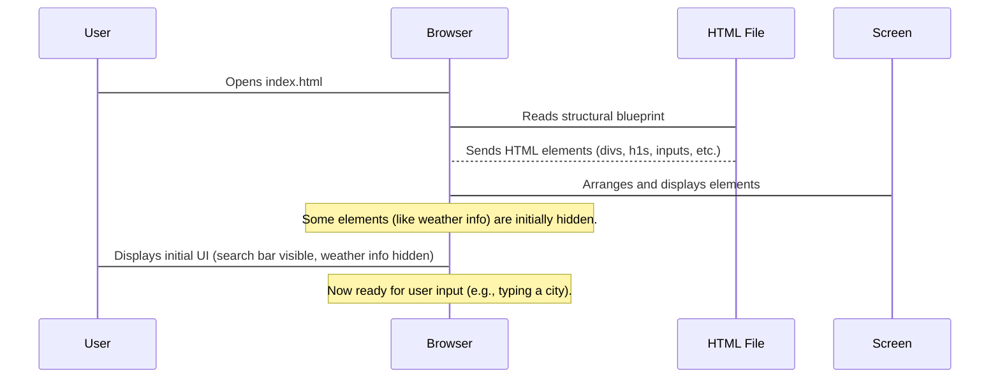

# Chapter 1: User Interface (UI) Structure

Welcome to the **Weather App** project! In this first chapter, we're going to explore what a "User Interface (UI) Structure" is. Think of it as drawing the blueprint for our app. Just like an architect draws plans for a house, we need a plan for where everything in our app will go.

### What is UI Structure?

Imagine you're building a house. Before you even pick out paint colors or furniture, you need to decide where the walls will go, where the windows will be, and which rooms are connected. This is exactly what UI structure is for our Weather App!

The **User Interface (UI) Structure** defines the complete layout and arrangement of all the elements you see on the web page. For our Weather App, this means deciding where the search bar for city names will go, where the main temperature will be displayed, where the detailed weather stats (like wind or humidity) will appear, and even where a "loading" message shows up.

**The big problem we're solving:** Without a clear structure, our app would just be a messy pile of information. UI structure helps us organize everything so that users can easily find what they're looking for and understand the information presented.

Our goal for this chapter is to understand how we set up this "blueprint" using HTML, which is the foundational language for building web pages.

### The Big Picture: The HTML Canvas

When you open a web page, your web browser (like Chrome, Firefox, or Edge) reads a special file called an `index.html` file. This `index.html` file is like our digital canvas. It contains all the instructions for what elements to draw on the screen and where to place them.

For our Weather App, the `index.html` file defines:
*   Where the app's title is.
*   The box where you type a city name.
*   The button you click to search.
*   Placeholders for where the temperature, weather icon, and other details will appear.
*   A little spinning circle that shows when the app is fetching weather data.

### Key Building Blocks: HTML Elements

To draw our UI blueprint, we use different "HTML elements." Think of these as the different types of building blocks we have for our house:

1.  **Containers (`<div>` tags):** These are like rooms or sections in your house. They don't show up on their own, but they help you group other elements together.
    *   Example: A `div` for the entire app, a `div` for the search section, and a `div` for all the weather information.
2.  **Text & Headings (`<h1>`, `<p>`, `<h3>` tags):** These are for displaying text.
    *   `<h1>` is for big, important titles (like the app name).
    *   `<h3>` is for smaller headings (like "Wind" or "Humidity").
    *   `<p>` is for regular paragraphs of text (like the temperature or city name).
3.  **Input Elements (`<input>`, `<button>` tags):** These are how users interact with our app.
    *   `<input>` is a box where you can type something (like a city name).
    *   `<button>` is a clickable button (like the "Search" button).
4.  **Images (`` tags):** Used to display pictures.
    *   Example: We'll use an `` tag to show a weather icon (like a sun for clear skies).

### How it all fits together: Our Weather App Blueprint

Let's look at a simplified version of our `index.html` file. Don't worry about understanding every single line, just focus on the main parts and how they group elements.

Our `index.html` file starts with a main "container" `div` that holds everything:

```html
<div class="container">
    <!-- All our app's UI elements will go inside this container -->
</div>
```
This `div` with the class `container` acts as the main boundary for our app on the web page. It's like the walls of our house, containing all the rooms and features.

Inside this main container, we have different sections:

**1. The Header (Welcome Area):**
This part defines the top section of our app, which usually includes the app's title and the search bar.

```html
<header>
    <h1 id="cityName">Weather App</h1>
    <form id="searchForm">
        <div class="search-container">
            <input type="text" id="cityInput" placeholder="Search for a city...">
            <button type="submit">Search</button>
        </div>
    </form>
    <p id="error" class="error"></p>
</header>
```
*   The `<header>` tag groups the title (`<h1>`), the search form (`<form>`), and a place for error messages (`<p>`).
*   Inside the `<form>`, we have an `<input>` box (where you type the city) and a `<button>` to submit your search.
*   The `placeholder` text inside the `input` gives you a hint of what to type.

**2. The Loading Spinner:**
Sometimes, our app needs to fetch data from the internet. While it's doing that, we want to show the user that something is happening. This `div` is designed for that:

```html
<div id="loading" class="loading hidden">
    <div class="spinner"></div>
</div>
```
*   This `div` with `id="loading"` holds a simple "spinner" animation.
*   Notice the `hidden` class. This means by default, this section **will not be visible** when the page first loads. It's like a secret room that only appears when needed!

**3. The Main Weather Information Display:**
This is the largest part of our app's UI, where all the weather details will be shown. Like the loading spinner, it's also `hidden` at first because we don't have weather data to show until the user searches for a city.

```html
<div id="weatherInfo" class="weather-info hidden">
    <div class="main-weather">
        
        <p id="weatherCondition"></p>
        <div class="temperature">
            <p id="temp"></p>
            <p id="lastUpdated" class="last-updated"></p>
        </div>
    </div>
    <div class="weather-stats">
        <div class="stat-card">
            <h3>Wind</h3>
            <p id="wind"></p>
        </div>
        <!-- More stat cards for humidity, pressure, etc. -->
    </div>
    <!-- More weather details sections -->
</div>
```
*   The main `div` with `id="weatherInfo"` contains everything related to the weather display.
*   It's broken down into smaller `div`s, like `main-weather` (for temperature and icon) and `weather-stats` (for detailed information).
*   Inside `weather-stats`, we have several `stat-card` `div`s. Each `stat-card` is like a small display panel for a specific weather detail (like "Wind" or "Humidity").

This way, our HTML blueprint clearly lays out where every piece of information and every interactive element will be placed on the screen.

### Under the Hood: How the Browser Draws Our UI

Let's quickly see what happens conceptually when you open our `index.html` file in your web browser.



1.  **User Opens App:** You type `index.html` (or click a link) in your browser.
2.  **Browser Reads Blueprint:** Your browser goes to the `index.html` file and starts reading it from top to bottom.
3.  **Elements Are Sent:** As the browser reads, it understands all the `<div>`, `<h1>`, `<input>`, and other tags. It builds an internal map of where everything should go.
4.  **Arrangement on Screen:** The browser then takes this internal map and "draws" the elements on your computer screen. It puts the header at the top, the search bar inside it, and reserves space for the loading spinner and weather information, even if they are hidden.
5.  **Ready for Interaction:** Once everything is drawn, the browser waits for you to interact, for example, by typing a city name into the search box.

### Conclusion

In this chapter, we've learned that the **User Interface (UI) Structure** is like the blueprint of our Weather App. It's defined in the `index.html` file using HTML elements like `div`s (for containers), `h1`s and `p`s (for text), `input`s and `button`s (for interaction), and `img`s (for images). We saw how these elements are organized and nested to create the layout of our app, with some parts initially hidden, ready to appear when needed.

Now that we have a solid structure, the next step is to make it look good! In [Chapter 2: Styling and Visual Presentation](02_styling_and_visual_presentation_.md), we'll dive into how we use CSS to add colors, fonts, and arrangements to our UI elements.

---
