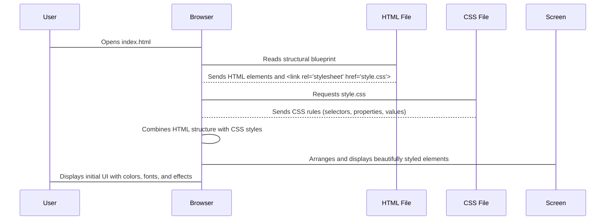

# Chapter 2: Styling and Visual Presentation

Welcome back to our **Weather App** journey! In [Chapter 1: User Interface (UI) Structure](01_user_interface__ui__structure_.md), we learned how to lay out the "blueprint" of our app using HTML. We decided where the search bar would go, where the temperature would appear, and where the details like wind speed or humidity would be. But if you were to open that HTML file right now, it would look pretty plain and boring – just black text on a white background, without any fancy designs.

### What is Styling and Visual Presentation?

Imagine you've built a house (our HTML blueprint). Now, it's time to decorate it! You want to paint the walls, choose nice furniture, add curtains, and maybe even put in some cool lighting. This is exactly what "Styling and Visual Presentation" does for our app!

**Styling** defines the entire look and feel of our Weather App. It's about choosing:
*   **Colors:** The background gradient, the text colors, highlights.
*   **Fonts:** What type of text style we use for headings and numbers.
*   **Spacing:** How much empty space is between elements so things don't look crowded.
*   **Visual Effects:** Transparent cards, soft shadows, and cool animations (like the loading spinner).

The **big problem we're solving:** A plain app is hard to read and not appealing. Styling makes our app look modern, professional, and easy for users to understand at a glance. It turns our basic blueprint into a beautiful, user-friendly experience.

Our goal for this chapter is to understand how we use **CSS** (Cascading Style Sheets) to give our Weather App its unique and modern look.

### The Interior Designer: CSS

CSS is like the interior designer for our web page. It's a special language that works hand-in-hand with HTML. While HTML decides *what* goes on the page and *where*, CSS decides *how* it looks.

In our Weather App, CSS is used to:
*   Give the entire background a smooth color gradient.
*   Make the search bar and weather information cards transparent with a cool blur effect.
*   Add a colorful gradient to our main temperature display and app title.
*   Make the little loading spinner animate.
*   Control the size, color, and style of all our text.

### How CSS Works: Rules for Styling

CSS works by applying "rules" to HTML elements. Each rule has three main parts:

1.  **Selector:** This tells CSS *which* HTML element(s) you want to style.
2.  **Property:** This tells CSS *what* aspect of the element you want to change (e.g., color, size, background).
3.  **Value:** This tells CSS *how* to change that aspect (e.g., `blue`, `20px`, `linear-gradient`).

Think of it like this:
*   **Selector:** "Find all the walls." (e.g., `body` or `.stat-card`)
*   **Property:** "Change their color." (e.g., `background-color`)
*   **Value:** "Make them light blue." (e.g., `lightblue`)

### Connecting Our HTML Blueprint to CSS Styles

Just like we need to tell our architect about the interior designer, we need to link our HTML file (`index.html`) to our CSS file (`style.css`). We do this with a special `<link>` tag inside the `<head>` section of our `index.html` file:

```html
<!-- Inside the <head> section of index.html -->
<link rel="stylesheet" href="style.css">
```
*   `rel="stylesheet"`: Tells the browser this is a stylesheet.
*   `href="style.css"`: Tells the browser where to find our CSS file.

Now, when the browser loads `index.html`, it will also load `style.css` and apply all the styling rules found there!

### Common CSS Building Blocks (Properties)

Let's look at some important CSS properties we'll use:

*   **`background`**: Sets the background color or image (or even a gradient!).
*   **`color`**: Sets the text color.
*   **`font-family`**: Changes the style of the text (e.g., Arial, sans-serif).
*   **`font-size`**: Changes how big the text is.
*   **`padding`**: Adds space *inside* an element, between its content and its border.
*   **`margin`**: Adds space *outside* an element, pushing other elements away.
*   **`border`**: Adds a line around an element.
*   **`border-radius`**: Makes the corners of an element rounded.
*   **`display`**: How an element behaves regarding layout (e.g., `flex` for arranging items in a row or column, `grid` for a more complex grid layout).
*   **`backdrop-filter`**: Applies graphical effects (like blur) to the area *behind* an element. This is key for our transparent cards!
*   **`transition`**: Creates smooth changes when a property changes (e.g., when you hover over something).
*   **`animation`**: Creates more complex, continuous motion (like our spinning loader).

### Styling Our Weather App: Examples from `style.css`

Let's see how we use these CSS rules in our `style.css` file to make our app look good.

**1. The App's Overall Look (`body` selector):**

We start by styling the `<body>` element, which represents the entire visible part of our web page.

```css
/* File: style.css */
body {
  font-family: "Segoe UI", Tahoma, Geneva, Verdana, sans-serif; /* Choose a clean font */
  background: linear-gradient(135deg, #1a1a2e, #16213e, #1a1a2e); /* Beautiful dark gradient */
  color: #ffffff; /* All text color is white by default */
  min-height: 100vh; /* Make sure the background covers the whole screen */
}
```
*   This makes the entire background a cool dark purple-blue gradient.
*   All default text becomes white and uses a modern font.

**2. The App Title (`h1` selector):**

Our `<h1>` tag in `index.html` holds the "Weather App" title. We want to make it stand out.

```css
/* File: style.css */
h1 {
  font-size: 4rem; /* Make it big! */
  background: linear-gradient(to right, #60a5fa, #34d399); /* Blue-green gradient */
  -webkit-background-clip: text; /* Magic: makes the gradient *fill* the text */
  background-clip: text;
  color: transparent; /* Makes the text itself transparent so gradient shows */
  text-shadow: 0 2px 4px rgba(0, 0, 0, 0.1); /* Adds a subtle shadow */
}
```
*   This creates the vibrant, gradient-filled text for our app title. It's a very modern effect!

**3. The Transparent Search Bar (`#cityInput` and `.search-container` selectors):**

Remember our `<input>` tag with `id="cityInput"` and the `<div>` with `class="search-container"` from [Chapter 1: User Interface (UI) Structure](01_user_interface__ui__structure_.md)? We want them to look transparent and sleek.

```css
/* File: style.css */
.search-container {
  display: flex; /* Arranges input and button nicely side-by-side */
}
#cityInput {
  background: rgba(31, 41, 55, 0.3); /* Semi-transparent dark background */
  border: 1px solid rgba(75, 85, 99, 0.5); /* Light border */
  border-radius: 1rem; /* Rounded corners */
  color: #ffffff; /* White text */
  backdrop-filter: blur(8px); /* The cool blur effect behind the input */
  background-image: url("https://cdn-icons-png.flaticon.com/256/14910/14910683.png"); /* Little search icon */
  background-position: 15px center; /* Position the icon */
  background-repeat: no-repeat; /* Don't repeat the icon */
}
#cityInput:focus { /* When the user clicks on the input box */
  border-color: #60a5fa; /* Blue border */
  box-shadow: 0 0 0 3px rgba(96, 165, 250, 0.2); /* Soft glow */
}
```
*   `rgba()` is `red, green, blue, alpha` (alpha is for transparency, 0.3 means 30% opaque).
*   `backdrop-filter: blur(8px)` is what makes the content *behind* our transparent card look blurry, giving it a cool frosted glass effect.

**4. The Weather Stat Cards (`.stat-card` selector):**

Our weather details (like Wind, Humidity) are shown in `div`s with the class `stat-card`. We style them to match the transparent theme and add a subtle hover effect.

```css
/* File: style.css */
.stat-card {
  background: rgba(31, 41, 55, 0.3); /* Same transparent dark background */
  padding: 1.5rem; /* Space inside the card */
  border-radius: 1rem; /* Rounded corners */
  border: 1px solid rgba(75, 85, 99, 0.5); /* Light border */
  backdrop-filter: blur(8px); /* Frosted glass effect */
  transition: transform 0.3s ease; /* Prepare for smooth hover effect */
}
.stat-card:hover { /* When the mouse hovers over the card */
  transform: translateY(-5px); /* Move it slightly up */
}
```
*   The `transition` property here is important! It tells the browser that if the `transform` property changes (like on `hover`), it should do so smoothly over 0.3 seconds, instead of instantly.

**5. The Loading Spinner Animation (`.spinner` selector):**

When our app is fetching data, we show a loading spinner. This involves not just styling, but also a simple animation.

```css
/* File: style.css */
.spinner {
  width: 3rem; /* Size of the spinner */
  height: 3rem;
  border: 4px solid #60a5fa; /* Blue border */
  border-top: 4px solid transparent; /* Top part is transparent, creating the gap */
  border-radius: 50%; /* Makes it a perfect circle */
  animation: spin 1s linear infinite; /* Applies the 'spin' animation */
}
/* Define the 'spin' animation */
@keyframes spin {
  to {
    transform: rotate(360deg); /* Rotate a full circle */
  }
}
```
*   `@keyframes` is how we define an animation. We named it `spin`.
*   The `animation` property applies this `spin` animation to our `.spinner` element, making it rotate continuously.

**6. Hiding Elements (`.hidden` class):**

You saw in Chapter 1 that some elements, like our loading spinner and weather info, are initially `hidden`. This is a simple but powerful CSS rule:

```css
/* File: style.css */
.hidden {
  display: none; /* This property completely removes the element from view */
}
```
*   When an element has `display: none;`, it's not just invisible, it's like it's not even there, and doesn't take up any space.
*   Later, our app will remove this `hidden` class using JavaScript when it's time to show these elements!

### Under the Hood: How the Browser Applies Styles

When you open our `index.html` file in your web browser, here's what happens regarding styling:



1.  **User Opens App:** You open `index.html`.
2.  **Browser Reads HTML:** Your browser starts reading the `index.html` file. It discovers all the HTML elements (like `div`s, `h1`s, `input`s) and how they are structured.
3.  **Browser Finds CSS Link:** It sees the `<link rel="stylesheet" href="style.css">` line.
4.  **Browser Loads CSS:** The browser then goes and fetches the `style.css` file.
5.  **Browser Applies Styles:** It reads all the rules in `style.css` and matches them to the HTML elements it found. For example, it finds the `body` element and applies the gradient background and white text. It finds the `h1` and applies the text gradient. It finds elements with `class="stat-card"` and applies the transparent background and blur.
6.  **Beautiful Display:** Finally, the browser draws everything on your screen, but this time, it's not just the blueprint; it's the fully decorated house with all the cool visual effects!

### Conclusion

In this chapter, we've learned that **Styling and Visual Presentation** is how we make our Weather App look good. We use **CSS** to add colors, fonts, spacing, transparent effects, and animations. We saw how CSS rules target specific HTML elements using **selectors** and then apply **properties** with specific **values** to change their appearance. By linking our `style.css` file to `index.html`, our browser knows exactly how to make our app visually appealing.

Now that our app has a beautiful structure and a stunning look, the next step is to make it interactive! In [Chapter 3: User Input & Interaction](03_user_input___interaction_.md), we'll explore how users can type city names and click buttons to make our app do things.

---
