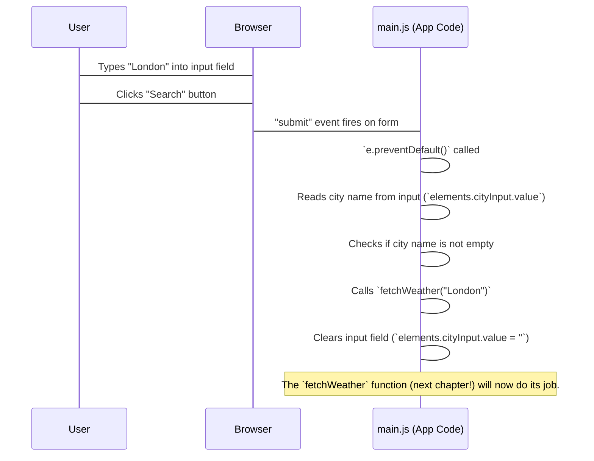

# Chapter 3: User Input & Interaction

Welcome back to our **Weather App** project! In [Chapter 1: User Interface (UI) Structure](01_user_interface__ui__structure_.md), we drew the blueprint of our app, deciding where everything would go. Then, in [Chapter 2: Styling and Visual Presentation](02_styling_and_visual_presentation_.md), we made our app look beautiful with colors, fonts, and cool transparent effects using CSS.

But right now, our app is like a beautiful, empty stage. It looks great, but it doesn't *do* anything when you interact with it. You can see the search box and the search button, but typing in a city name and clicking "Search" won't make anything happen.

### What is User Input & Interaction?

This chapter is all about making our app **come alive** and **respond to you!** Imagine you're talking to someone. They need to listen to what you say and then do something based on your words. Our app needs to do the same thing.

**User Input & Interaction** is how our app "hears" what you type into the city search box and "knows" when you click the "Search" button. It's like giving our app ears and hands so it can respond to your commands.

**The big problem we're solving:** Without interaction, our app is just a static picture. We need a way for the user to tell the app, "Hey, I want to see the weather for London!" and for the app to actually go and get that information.

Our goal for this chapter is to understand how we use **JavaScript** to listen for these user actions and kick off the process of getting weather data.

### The App's Ears: Event Listeners

How does our app "hear" you? It uses something called an **"Event Listener."**

Think of an event listener like a dedicated lookout person. This person's job is to constantly watch for a specific "event" to happen. When that event occurs (like you typing a key or clicking a button), the lookout person immediately shouts, "Hey, that happened!" and then tells another part of the app what to do next.

In our Weather App, we care about two main events:

1.  **Typing in the Search Box:** Although we don't directly listen for *every* key press, we are interested in the *value* of the text the user has typed.
2.  **Clicking the "Search" Button (or pressing Enter):** This is the main "go!" signal.

We use a special JavaScript command called `addEventListener` to set up these lookouts.

```javascript
// This is like telling our app:
// "Hey, when something specific happens on this part of the app,
// I want you to run a certain block of code."
someElement.addEventListener('event_type', whatToDoFunction);
```

*   `someElement`: This is the part of our UI blueprint (from `index.html`) that we want to watch (like the search form or the button).
*   `'event_type'`: This is the specific action we're waiting for (e.g., `'click'`, `'submit'`, `'DOMContentLoaded'`).
*   `whatToDoFunction`: This is the block of JavaScript code that will run *when* the event happens.

### Getting What the User Typed: Reading the Input Box

Once the user clicks "Search," we need to know *what* city they typed.

Imagine the search box is a sticky note where the user writes their city. To read it, we just need to look at its "value."

In JavaScript, every input box has a `value` property. We can access it like this:

```javascript
// Imagine 'cityInputBox' is our search input field
const cityTyped = cityInputBox.value;

console.log("The user typed:", cityTyped);
// Example: "The user typed: London"
```

The `.value` part gives us the text that is currently inside the input field. We also often use `.trim()` to remove any extra spaces from the beginning or end of the text, just to keep things neat!

### Stopping Unwanted Actions: Preventing Default Behavior

When you have a `<form>` (like our search form in `index.html`) and you click a `<button type="submit">` inside it (our "Search" button), browsers have a default behavior: they try to reload the entire web page.

For our Weather App, we *don't* want the page to reload every time someone searches for a city! We want our app to fetch new weather data in the background and update just the relevant parts of the screen.

To stop this automatic page reload, we use `event.preventDefault()`.

```javascript
// Imagine this is inside our 'whatToDoFunction'
function handleSearch(event) {
    event.preventDefault(); // Stop the page from reloading!
    // Now we can do our own custom actions, like fetching weather
}
```

The `event` here is an object that contains details about the event that just happened (like the click or form submission). Calling `event.preventDefault()` tells the browser, "Hold on, I'll handle this myself; don't do your usual thing!"

### How It Works in Our Weather App: Connecting the Pieces

Let's see how our `main.js` file (which contains all our JavaScript code) puts these concepts together to make the Weather App interactive.

**1. Finding the Important Parts of Our Blueprint**

First, our JavaScript code needs a way to "find" the specific HTML elements it wants to listen to or read from. Remember the `id` attributes we gave to our elements in [Chapter 1: User Interface (UI) Structure](01_user_interface__ui__structure_.md), like `id="searchForm"` for the form and `id="cityInput"` for the input box?

We use `document.getElementById()` to get a reference to these elements:

```javascript
// In main.js, we first gather all the elements we'll need to interact with
const elements = {
	form: document.getElementById('searchForm'),    // Our entire search form
	cityInput: document.getElementById('cityInput'),// The box where you type
	error: document.getElementById('error'),        // Where error messages show
	loading: document.getElementById('loading'),    // Our spinning loader
	weatherInfo: document.getElementById('weatherInfo'), // The weather display area
	// ... (many more elements are stored here for later use)
};
```
This `elements` object is like our app's address book. It holds references to all the important parts of the UI, making it easy for our JavaScript code to interact with them. For example, `elements.form` now directly refers to the `<form id="searchForm">` in our HTML.

**2. Listening for the Search Action**

Now that we have a reference to our search form, we can tell it to listen for the "submit" event. This event fires when the user clicks the "Search" button or presses Enter while typing in the input field.

```javascript
// In main.js, near the end of the file
elements.form.addEventListener('submit', (e) => {
    e.preventDefault(); // Stop the page from reloading!

    const city = elements.cityInput.value.trim(); // Get text from input box

    if (city) { // If the user actually typed something
        fetchWeather(city); // Start getting weather data for that city
        elements.cityInput.value = ''; // Clear the input box after search
    }
});
```
*   `elements.form.addEventListener('submit', ...)`: This line sets up our "lookout" on the search form. When the form is submitted, the code inside the `(...) => { ... }` block will run.
*   `e.preventDefault();`: As explained before, this stops the browser from reloading the page, letting our JavaScript handle everything smoothly.
*   `const city = elements.cityInput.value.trim();`: We read the text from the `cityInput` box and store it in a variable called `city`.
*   `if (city)`: This is a small check to make sure the user actually typed a city name and didn't just submit an empty box.
*   `fetchWeather(city);`: This is a special function (we'll explore it in [Chapter 4: Weather API Integration](04_weather_api_integration_.md)) that starts the process of talking to a weather service to get information for the `city` the user typed.
*   `elements.cityInput.value = '';`: After searching, it's good practice to clear the input box so the user can easily type a new city.

**3. Showing Initial Weather on Load**

Sometimes, we want our app to do something as soon as it opens, even before the user does anything. For example, our Weather App loads weather for "Bangalore" by default.

To do this, we listen for a special event called `'DOMContentLoaded'`. This event fires when the web page (all the HTML elements) has completely loaded and is ready to be interacted with.

```javascript
// In main.js, at the very end
document.addEventListener('DOMContentLoaded', () => {
    fetchWeather('Bangalore'); // Get weather for Bangalore when the page loads
});
```
*   `document.addEventListener('DOMContentLoaded', ...)`: This sets up a lookout on the entire web page (`document`). When all the HTML is ready, the code inside the block will run.
*   `fetchWeather('Bangalore');`: This immediately calls our `fetchWeather` function with "Bangalore" as the default city.

### Under the Hood: The Interaction Flow

Let's trace what happens when you type "London" and click "Search":



1.  **User Types:** You type "London" into the search box. The `cityInput` element now holds this value.
2.  **User Clicks:** You click the "Search" button. Because this button is inside a `<form>` and has `type="submit"`, it triggers a "submit" event on the form itself.
3.  **Browser Notifies `main.js`:** The browser sees that our `main.js` has an event listener set up for the "submit" event on that form. So, it calls the function we provided to the `addEventListener`.
4.  **`main.js` Takes Over:**
    *   First, `e.preventDefault()` stops the page from reloading.
    *   Then, `main.js` looks at `elements.cityInput.value` and gets "London".
    *   It checks if "London" is a valid (not empty) city.
    *   Finally, it calls the `fetchWeather("London")` function, starting the process of getting actual weather data.
    *   It also clears the input box.

This entire process happens very quickly, making the app feel responsive and smooth!

### Conclusion

In this chapter, we've brought our Weather App to life! We learned that **User Input & Interaction** is handled by **JavaScript** using **event listeners**. We saw how `addEventListener` allows our app to "hear" user actions like clicking the "Search" button. We also learned how to read text from input fields using `.value` and how to prevent unwanted page reloads with `event.preventDefault()`.

Now that our app can listen to the user and know which city to search for, the next big step is to actually go out and get that weather data from somewhere on the internet! In [Chapter 4: Weather API Integration](04_weather_api_integration_.md), we'll dive into how our app talks to external services to fetch real-time weather information.

---
