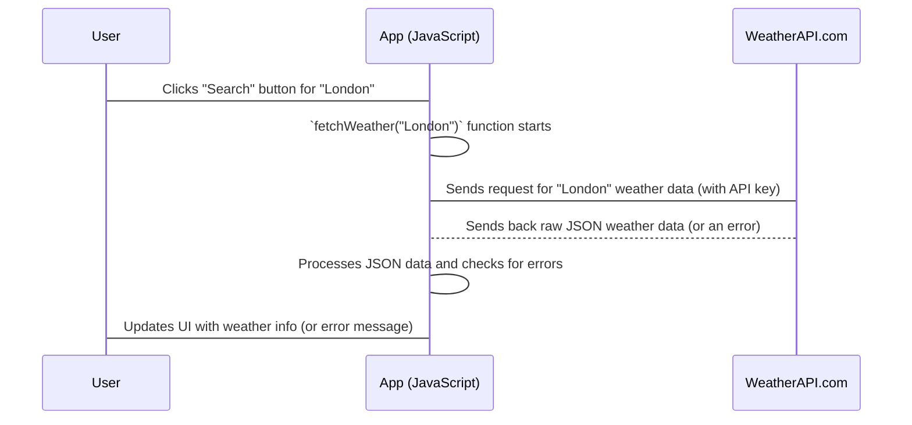

# Chapter 4: Weather API Integration

Welcome back to our **Weather App** journey! In [Chapter 1: User Interface (UI) Structure](01_user_interface__ui__structure_.md), we drew the blueprint of our app. In [Chapter 2: Styling and Visual Presentation](02_styling_and_visual_presentation_.md), we made it look beautiful. Then, in [Chapter 3: User Input & Interaction](03_user_input___interaction_.md), we gave our app "ears" and "hands" so it could listen when you typed a city and clicked "Search."

Now, our app knows *what* city you want the weather for. But where does it get that weather information from? It certainly doesn't know it by magic!

### What is Weather API Integration?

Imagine you're at a restaurant, and you want to order a specific dish. You don't go into the kitchen yourself; you tell the waiter what you want. The waiter then goes to the kitchen, gets the dish, and brings it back to you.

In our Weather App, the "kitchen" is an external weather service on the internet (like `WeatherAPI.com`), and our app needs a "waiter" or "messenger" to talk to it.

**Weather API Integration** is exactly this "waiter" for our app. It's the part of our code that:
1.  **Sends a request** (your order) to the external weather service.
2.  **Waits** for the response (the food, or in our case, the weather data).
3.  **Brings back** all the raw weather data (like temperature, humidity, wind speed, etc.) to our app.

**The big problem we're solving:** Our app needs real, up-to-date weather information from somewhere! This integration ensures our app can connect to the internet and get the live data it needs to show you accurate weather for any city.

Our goal for this chapter is to understand how our app acts as a messenger, talking to `WeatherAPI.com` to fetch current weather details.

### What is an API? (Our App's Messenger Service)

API stands for **Application Programming Interface**. Don't worry about the big words! Just think of an API as a set of rules and tools that allow different software applications to talk to each other.

For our Weather App:
*   Our app (the user interface you see) is one application.
*   `WeatherAPI.com` (the service that has all the weather data) is another application.

The `WeatherAPI.com` API is like a special phone number and a list of questions our app can ask to get specific weather information. When our app calls this "phone number" (sends a request), it gets back the weather data in a structured format.

### The Key Ingredients for a Request

To ask `WeatherAPI.com` for weather data, our app needs three main things:

1.  **The Address (URL):** Just like a website has an address (like `google.com`), an API also has an address called a **URL** (Uniform Resource Locator). This is where our request needs to go. For weather data, it looks something like `https://api.weatherapi.com/v1/current.json`.
2.  **Your Question (Parameters):** We don't want *all* weather data, we want weather for a *specific city*. We also need to tell the API that we're allowed to ask questions. We do this by adding "parameters" to our URL, like `?q=London` (for the city) and `&key=YOUR_API_KEY` (for permission).
3.  **Your Secret Key (API Key):** Many APIs, especially those that provide valuable data, require an **API Key**. This is a unique secret code given to you when you sign up. It tells the service, "Hey, I'm an authorized user, and I'm allowed to ask for data." Think of it as your digital passport or a secret handshake.

We store our `APIKEY` in a separate file called `config.js` to keep it safe and separate from our main code:

```javascript
// File: config.js
const APIKEY = "YOUR_SUPER_SECRET_API_KEY_HERE";
// Make sure you replace "YOUR_SUPER_SECRET_API_KEY_HERE"
// with your actual key from WeatherAPI.com!
```
This keeps our key organized and prevents it from being accidentally exposed if we share our `main.js` file.

### Making the Call: The `fetch` Function

In JavaScript, we use a built-in tool called `fetch` to send our request to the API. `fetch` is like sending a message across the internet and waiting for a reply.

When we use `fetch`, we give it the complete URL with all our parameters and API key.

```javascript
// A simplified look at how we ask for data
async function askWeatherAPI(cityToSearch) {
    const MY_API_KEY = "YOUR_KEY"; // Just for this example
    const url = `https://api.weatherapi.com/v1/current.json?key=${MY_API_KEY}&q=${cityToSearch}&aqi=no`;

    // Send the request and wait for a response
    const response = await fetch(url);
    // ... we'll look at what happens next below!
}
```
*   `async function`: This means this function will do something that takes time (like waiting for a response from the internet) and we'll use `await` inside it.
*   `await fetch(url)`: This is the core part! It sends the request to the `url` we built and *pauses* our code here until the internet responds. Once the response comes back, it's stored in the `response` variable.

### Getting the Response: Raw Data to Usable Data

When `fetch` gets a `response` back, it's not immediately ready for us to use. It's like receiving a sealed package; we need to open it. The data from APIs often comes in a special format called **JSON** (JavaScript Object Notation). It's a way of organizing information that's easy for computers to read.

To "open" the package and convert the raw JSON data into something our JavaScript code can easily work with, we use `.json()`:

```javascript
// Continuing from the previous example
async function askWeatherAPI(cityToSearch) {
    // ... (building the URL and fetching)
    const response = await fetch(url);

    // If the response wasn't successful (e.g., city not found)
    if (!response.ok) { // 'ok' means status is 200-299
        throw new Error(`HTTP error! Status: ${response.status}`);
    }

    // Convert the raw response into a usable JavaScript object
    const weatherData = await response.json();

    console.log("Here's the weather data:", weatherData);
    // Example: { "location": { ... }, "current": { ... } }
    return weatherData;
}
```
*   `if (!response.ok)`: It's good practice to check if the request was successful. Sometimes, an API might send back an error (like "city not found") with a special status code. `response.ok` tells us if the response was generally successful (status code 200-299).
*   `await response.json()`: This line takes the raw internet response and transforms it into a JavaScript object (like a collection of organized information) that we can easily use.

### Being a Good Messenger: Handling Success and Problems

Talking to the internet can sometimes go wrong! The internet might be down, the API service might be busy, or we might have asked for something that doesn't exist. Our app needs to be prepared for these situations.

We use a special JavaScript structure called `try...catch...finally` to handle these scenarios:

*   **`try`**: "Try to do this code." This is where we put the code that might cause an error (like making an internet request).
*   **`catch (error)`**: "If something goes wrong in the `try` block, catch the error here and do this." This is where we handle any problems, perhaps by showing an error message to the user.
*   **`finally`**: "No matter what happens (whether there was an error or not), always do this code." This is useful for things that *always* need to happen, like hiding a loading spinner once the request is complete.

### How it Works in Our App: The `fetchWeather` Function

In our `main.js` file, the `fetchWeather` function combines all these ideas. This is the "waiter" that [Chapter 3: User Input & Interaction](03_user_input___interaction_.md) calls when you click "Search."

Here's a simplified look at the `fetchWeather` function:

```javascript
// File: main.js

// Import our API key from the config file
import { APIKEY } from './config.js';

async function fetchWeather(city) {
    try {
        // 1. Show a loading spinner (from Chapter 2)
        // elements.loading.classList.remove('hidden'); // Simplified: showLoading(true);

        // 2. Build the full URL with our city and API key
        const url = `https://api.weatherapi.com/v1/current.json?key=${APIKEY}&q=${city}&aqi=no`;

        // 3. Send the request and wait for the raw response
        const response = await fetch(url);

        // 4. Convert the raw response into a usable JavaScript object
        const data = await response.json();

        // 5. Check if the API sent back an error (e.g., city not found)
        if (data.error) {
            // showError(data.error.message); // Simplified: show an error
            return; // Stop here if there's an error from the API
        }

        // 6. If all is good, update the UI with the new data (next chapter!)
        // updateWeatherUI(data); // Simplified: display data
    } catch (err) {
        // 7. If anything went wrong during the internet call, show a generic error
        // showError('Failed to fetch weather data'); // Simplified: show generic error
    } finally {
        // 8. Always hide the loading spinner, whether successful or not
        // elements.loading.classList.add('hidden'); // Simplified: showLoading(false);
    }
}
```
*   Notice how `fetchWeather` uses the `APIKEY` we imported from `config.js`.
*   The comments show where other helper functions (like `showLoading` and `updateWeatherUI`) would be called. We'll learn more about `updateWeatherUI` in [Chapter 6: UI Data Rendering](06_ui_data_rendering_.md).

### Under the Hood: The API Call Flow

Let's trace the journey of a weather request from your app to `WeatherAPI.com` and back:



1.  **User Initiates Search:** You type "London" and click "Search," which (as we learned in [Chapter 3: User Input & Interaction](03_user_input___interaction_.md)) triggers our `fetchWeather` function.
2.  **App Sends Request:** Our `fetchWeather` function constructs the URL and uses `fetch` to send a request over the internet to `WeatherAPI.com`.
3.  **WeatherAPI.com Responds:** `WeatherAPI.com` receives the request, checks the API key, finds the weather data for "London," and sends it back to our app as a JSON response.
4.  **App Processes Response:** Our app receives the raw JSON data, converts it into a usable JavaScript object, and checks if there were any problems from the API itself.
5.  **App Updates UI:** Finally, if everything is successful, our app takes this fresh weather data and updates all the different parts of the UI (temperature, wind, humidity, etc.). If there was an error, it would display an error message instead.

### Conclusion

In this chapter, we explored **Weather API Integration**, the crucial part of our app that communicates with the outside world. We learned that an **API** is like a messenger service that allows our app to talk to `WeatherAPI.com`. We saw how the `fetch` function in JavaScript makes requests over the internet, using a special URL with parameters and an **API Key** for authentication. We also understood the importance of `try...catch...finally` for handling potential internet issues and errors.

Now that our app can successfully fetch live weather data, the next challenge is to manage all this information and make sure our app behaves correctly at different stages (like showing loading states or error messages). In [Chapter 5: Application State Management](05_application_state_management_.md), we'll dive into how we keep track of what our app is doing and what information it currently has.

---
