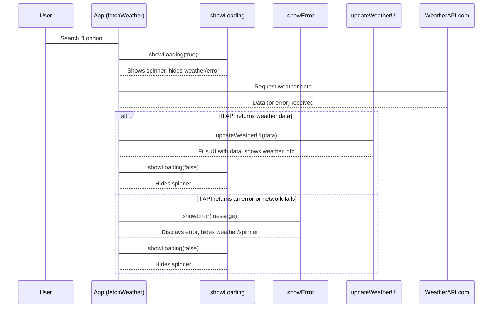

# Chapter 5: Application State Management

Welcome back to our **Weather App** project! In [Chapter 1: User Interface (UI) Structure](01_user_interface__ui__structure_.md), we designed the blueprint. In [Chapter 2: Styling and Visual Presentation](02_styling_and_visual_presentation_.md), we made it beautiful. And in [Chapter 3: User Input & Interaction](03_user_input___interaction_.md), we gave our app "ears" and "hands" so it could listen to your commands. Most recently, in [Chapter 4: Weather API Integration](04_weather_api_integration_.md), we learned how our app talks to the internet to fetch real-time weather data.

Now, imagine our app has just asked the weather API for data for "London." What happens next? The data doesn't appear instantly. There's a short delay while the internet does its work. During this time, we don't want the screen to be blank or to show old information. We want to show a clear message like "Loading..." or a spinning wheel. And what if there's a problem, like "City not found"? We need to show an error!

### What is Application State Management?

Think of **Application State Management** as the app's internal "brain" or a "traffic controller" for its user interface. It answers questions like:

*   "What is the app doing right now?" (Is it waiting for data? Has it found an error? Is it showing results?)
*   "Based on what the app is doing, what should the user *see*?"

The **big problem we're solving:** Our app isn't always in the same "mode." It changes what it's doing, and what it's doing affects what the user should see. Without state management, our app would be confusing. Users wouldn't know if it's working, if there's an error, or if they need to wait. State management ensures our app always provides clear feedback, showing only the relevant parts of the UI at any given moment.

Our goal for this chapter is to understand how we use JavaScript to control these different "modes" or **states** of our app, making sure the right visual elements (like the loading spinner, error message, or weather details) are visible at the right time.

### Key Application States

Our Weather App can be in a few important "states" or "modes":

| State Name          | What the App is Doing                        | What the User Sees (UI)                                |
| :------------------ | :------------------------------------------- | :----------------------------------------------------- |
| **Initial State**   | Just launched, waiting for user input.       | Search bar visible, weather info & loader hidden.      |
| **Loading State**   | Fetching data from the weather API.          | Loading spinner visible, weather info & error hidden.  |
| **Display State**   | Successfully received and processed data.    | Full weather information visible, loader & error hidden. |
| **Error State**     | Failed to get data or received an error.     | Error message visible, weather info & loader hidden.   |

### How Our App Manages State: The `hidden` Class and JavaScript

In [Chapter 1: User Interface (UI) Structure](01_user_interface__ui__structure_.md) and [Chapter 2: Styling and Visual Presentation](02_styling_and_visual_presentation_.md), we saw that our `index.html` blueprint has sections for the loading spinner (`id="loading"`) and the main weather display (`id="weatherInfo"`). Both of these initially have a special `hidden` class:

```html
<!-- From index.html -->
<div id="loading" class="loading hidden">
    <div class="spinner"></div>
</div>
<div id="weatherInfo" class="weather-info hidden">
    <!-- ... all weather details here ... -->
</div>
<p id="error" class="error"></p>
```
And in `style.css`, this `hidden` class simply makes elements disappear:

```css
/* From style.css */
.hidden {
  display: none; /* Completely removes the element from view */
}
```

Our "traffic controller" in `main.js` works by **adding or removing** this `hidden` class from these HTML elements.

We use a few helper functions in our `main.js` to manage these states:

1.  **`showLoading(show)`**: This function turns the loading spinner on or off. It also hides the weather information area.
2.  **`showError(message)`**: This function displays an error message and hides the weather information and loading spinner.
3.  **`updateWeatherUI(data)`**: (Detailed in [Chapter 6: UI Data Rendering](06_ui_data_rendering_.md)) This function takes the fetched weather data and fills in all the details on the screen, also ensuring the weather info area is visible and other states are hidden.

### Step-by-Step State Changes with Code Examples

Let's see how our `main.js` orchestrates these state changes using the `fetchWeather` function, which we first encountered in [Chapter 4: Weather API Integration](04_weather_api_integration_.md).

First, recall how our app starts an action when you search or when the page loads:

```javascript
// From main.js
// When the form is submitted (user clicks Search or presses Enter)
elements.form.addEventListener('submit', (e) => {
    e.preventDefault();
    const city = elements.cityInput.value.trim();
    if (city) {
        fetchWeather(city); // This starts the process!
        elements.cityInput.value = '';
    }
});

// When the page finishes loading for the first time
document.addEventListener('DOMContentLoaded', () => {
    fetchWeather('Bangalore'); // Show weather for Bangalore initially
});
```
Both of these trigger `fetchWeather()`. Let's look at how `fetchWeather` then manages the different states.

**1. Entering the Loading State (Before Fetching Data)**

As soon as `fetchWeather` is called, we know we're about to talk to the internet. This is the perfect time to show the loading spinner and hide everything else:

```javascript
// Simplified fetchWeather from main.js
async function fetchWeather(city) {
    try {
        showLoading(true); // Call our helper function: "Show the loading spinner!"
        // ... (The actual 'fetch' call to WeatherAPI.com happens here) ...
    } catch (err) {
        // ... (Error handling) ...
    } finally {
        // ... (Code that always runs, like hiding spinner) ...
    }
}
```
The `showLoading(true)` function is responsible for making the spinner visible and hiding the other parts of the UI.

**2. Exiting the Loading State: Success or Error**

Once the `fetch` operation (from [Chapter 4: Weather API Integration](04_weather_api_integration_.md)) is complete, either successfully or with an error, we need to hide the loading spinner. Then, depending on the outcome, we either show the weather data or an error message.

```javascript
// Simplified fetchWeather from main.js (continued)
async function fetchWeather(city) {
    try {
        showLoading(true);
        const response = await fetch(`YOUR_API_URL_HERE`);
        const data = await response.json();

        if (data.error) {
            showError(data.error.message); // An error from the API: show error message
            return; // Stop here
        }

        // If we reach here, it's a success!
        // updateWeatherUI(data); // Fill the UI with data (details in Chapter 6)
    } catch (err) {
        showError('Failed to fetch weather data'); // A network error: show generic message
    } finally {
        showLoading(false); // Always hide the spinner, regardless of success or error
    }
}
```

Notice that `showLoading(false)` is inside the `finally` block. This ensures the spinner is hidden *after* the `try` block completes (whether successfully or with an error) or the `catch` block finishes. It's a clean way to ensure our UI returns to a non-loading state.

### Under the Hood: The State Transition Flow

Let's visualize how the "traffic controller" (`fetchWeather`) directs what's visible on the screen:



This diagram shows that `fetchWeather` acts as the orchestrator. It tells `showLoading` to turn the spinner on, then makes the network call. Once the response comes back, it makes a decision: if successful, it calls `updateWeatherUI`; if there's an error, it calls `showError`. Finally, it always calls `showLoading(false)` to ensure the spinner is gone.

### Code Dive: The State Management Functions in `main.js`

Here are the actual implementations of our state management helper functions in `main.js`:

**1. `showLoading(show)` Function:**

```javascript
// From main.js
function showLoading(show) {
    // Toggles the 'hidden' class on the loading spinner
    // If 'show' is true, 'hidden' is removed. If 'show' is false, 'hidden' is added.
    elements.loading.classList.toggle('hidden', !show);

    // Hides the weather info when loading is active (show=true)
    // or shows it when loading is off (show=false)
    elements.weatherInfo.classList.toggle('hidden', show);

    // Always clear any previous error messages when loading or displaying weather
    elements.error.textContent = '';
}
```
*   `elements.loading.classList.toggle('hidden', !show)`: This is a clever way to add or remove the `hidden` class. If `show` is `true`, `!show` is `false`, so `toggle` *removes* `hidden`. If `show` is `false`, `!show` is `true`, so `toggle` *adds* `hidden`. This makes the spinner appear/disappear.
*   `elements.weatherInfo.classList.toggle('hidden', show)`: This is the opposite! When `show` is `true` (we're showing the spinner), we want to *hide* the weather info. When `show` is `false`, we want to *show* the weather info.
*   `elements.error.textContent = '';`: It's good practice to clear the error message whenever we start loading or successfully show weather, so old errors don't linger.

**2. `showError(message)` Function:**

```javascript
// From main.js
function showError(message) {
    elements.error.textContent = message; // Display the error message

    // Make sure the weather info and loading spinner are hidden
    elements.weatherInfo.classList.add('hidden');
    elements.loading.classList.add('hidden');
}
```
*   `elements.error.textContent = message;`: This updates the `<p id="error">` element with the actual error text.
*   `elements.weatherInfo.classList.add('hidden');` and `elements.loading.classList.add('hidden');`: These lines explicitly hide the weather display and the loading spinner, ensuring only the error message is visible.

By calling these small, focused functions, our `fetchWeather` function (and thus our app) can smoothly transition between showing a loading state, a successful weather display, or an error message, providing clear feedback to the user at all times.

### Conclusion

In this chapter, we've explored **Application State Management**, which is all about how our Weather App keeps track of what it's doing and what information it should display. We learned how different "states" (like loading, displaying data, or showing an error) affect the user interface. By dynamically adding and removing the `hidden` CSS class using JavaScript helper functions like `showLoading` and `showError`, our app can act like a smart "traffic controller," always ensuring the right UI elements are visible at the right time.

Now that our app knows *when* to show things, the next step is to fill those visible parts of the UI with the actual weather data we fetched! In [Chapter 6: UI Data Rendering](06_ui_data_rendering_.md), we'll dive into how we take the raw data from the API and display it beautifully on the screen.

---
