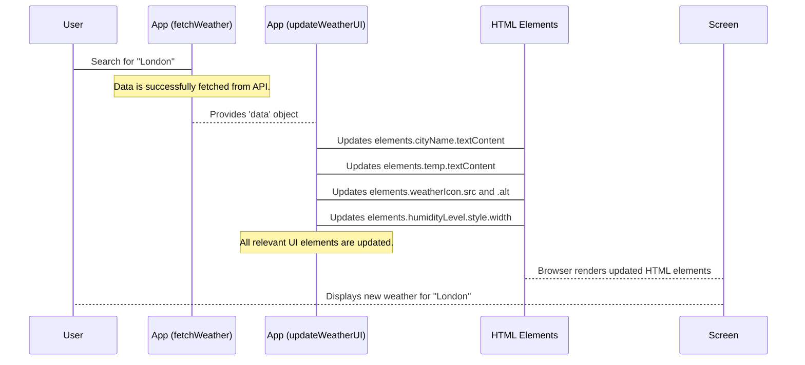

# Chapter 6: UI Data Rendering

Welcome back to our **Weather App** project! In [Chapter 1: User Interface (UI) Structure](01_user_interface__ui__structure_.md), we drew the blueprint, and in [Chapter 2: Styling and Visual Presentation](02_styling_and_visual_presentation_.md), we made it beautiful. [Chapter 3: User Input & Interaction](03_user_input___interaction_.md) gave our app ears and hands to listen to your commands. Most recently, in [Chapter 4: Weather API Integration](04_weather_api_integration_.md), our app learned how to talk to the internet to fetch real-time weather data. And in [Chapter 5: Application State Management](05_application_state_management_.md), we made sure our app intelligently shows "Loading..." or "Error!" at the right times.

Now, we've successfully **fetched** the weather data from `WeatherAPI.com`, and our app knows it's time to **display** it. But how do we take that raw information – a bunch of numbers and text received from the internet – and put it neatly into the correct spots on our beautiful web page?

### What is UI Data Rendering?

Imagine you're an intelligent painter. Someone hands you a piece of paper with a list of instructions: "Paint the temperature 25°C in the big box, draw a sun icon next to it, and put the humidity at 70% on the little bar." You wouldn't just scribble everything anywhere! You'd carefully take each piece of information and paint it into the exact right place on your canvas.

**UI Data Rendering** is exactly this "intelligent painter" for our app. It's the part of our code that:
1.  **Receives** the raw weather information (the "instructions").
2.  **Identifies** where each piece of information should go on the web page (the "right spots").
3.  **Updates** those spots with the new data (the "painting").

**The big problem we're solving:** The data we get from the API is just structured text and numbers. It doesn't automatically show up on our screen! We need a dedicated process to "render" or "draw" this data onto our UI, making it visible and understandable to the user. This ensures that when you search for "London," you see London's temperature, wind, and humidity, not just a blank screen or old data.

Our goal for this chapter is to understand how our app takes the fetched weather data and populates all the different text fields, images, and even progress bars on the screen.

### The Painter's Toolkit: HTML Elements and Data Fields

To render the data, our app needs two things:

1.  **The "Canvas Spots" (HTML Elements):** These are the placeholders we created in [Chapter 1: User Interface (UI) Structure](01_user_interface__ui__structure_.md) using HTML tags like `<p>` for text, `` for images, and `<div>` for bars. We gave them unique `id`s (like `id="temp"` or `id="weatherIcon"`) so our JavaScript could easily find them.
    *   Recall, our `main.js` file starts by collecting references to all these elements into an `elements` object:
        ```javascript
        // From main.js
        const elements = {
            cityName: document.getElementById('cityName'), // The h1 for city name
            temp: document.getElementById('temp'),         // The p tag for temp
            weatherIcon: document.getElementById('weatherIcon'), // The img tag for icon
            humidityLevel: document.getElementById('humidityLevel'), // The div for humidity bar
            // ... many more elements for wind, pressure, etc.
        };
        ```
2.  **The "Paint" (Fetched Weather Data):** This is the JavaScript object that `fetchWeather` (from [Chapter 4: Weather API Integration](04_weather_api_integration_.md)) brings back from the API. It contains all the weather details neatly organized.
    *   A simplified look at the `data` structure:
        ```javascript
        // This is what the 'data' object looks like (simplified)
        const data = {
            location: {
                name: "London",
                region: "City of London, Greater London",
                localtime: "2024-05-15 10:30"
            },
            current: {
                temp_c: 15.5,
                temp_f: 60,
                condition: {
                    text: "Partly cloudy",
                    icon: "//cdn.weatherapi.com/weather/64x64/day/116.png"
                },
                humidity: 70,
                wind_kph: 10,
                uv: 4
                // ... many more weather details
            }
        };
        ```
        Notice how information is organized inside `location` and `current`.

### The Painter in Action: The `updateWeatherUI` Function

In our `main.js` file, the `updateWeatherUI(data)` function is our "intelligent painter." It receives the `data` object and then goes through each piece of information, putting it into the right HTML element.

This function is called by `fetchWeather` when the data has been successfully retrieved, as we saw in [Chapter 5: Application State Management](05_application_state_management_.md).

```javascript
// From main.js
function updateWeatherUI(data) {
    // We break down the 'data' object into smaller, easier-to-use parts
    const { location, current } = data;

    // Now, let's start painting the UI!

    // 1. Update City Name & Location Details
    elements.cityName.textContent = location.name;
    elements.region.textContent = `${location.region}, ${location.country}`;
    elements.localTime.textContent = `Local Time: ${location.localtime}`;

    // 2. Update Main Weather Info (Icon, Condition, Temperature)
    elements.weatherIcon.src = current.condition.icon.replace('64x64', '128x128');
    elements.weatherIcon.alt = current.condition.text;
    elements.weatherCondition.textContent = current.condition.text;
    elements.temp.textContent = `${Math.round(current.temp_c)}°C`;
    elements.tempF.textContent = `${Math.round(current.temp_f)}°F`;

    // 3. Update Detailed Stats (Wind, Humidity, Pressure, etc.)
    elements.wind.textContent = `Wind Speed: ${current.wind_kph} km/h`;
    elements.humidity.textContent = `Humidity: ${current.humidity}%`;
    elements.humidityLevel.style.width = `${current.humidity}%`; // For the bar!

    // ... (many more lines to update all other fields) ...

    // Finally, ensure the weather info section is visible
    // (This is handled by showLoading(false) in fetchWeather, but implicitly
    // updateWeatherUI's job is to prepare the content for display.)
}
```

Let's look at a few examples of how data is rendered for different types of UI elements:

**Example 1: Updating Text Content (`.textContent`)**

For most text-based information like city names, conditions, or numerical values, we simply update the `textContent` property of the corresponding HTML element.

```javascript
// From updateWeatherUI function in main.js
// For the main city name display (which is an <h1> tag)
elements.cityName.textContent = location.name; // e.g., "London"

// For the temperature (a <p> tag)
elements.temp.textContent = `${Math.round(current.temp_c)}°C`; // e.g., "16°C"
```
*   `elements.cityName.textContent = location.name;`: This takes the `name` property from the `location` part of our data (e.g., "London") and places it directly inside the `<h1>` tag with `id="cityName"`.
*   `Math.round()` is used to make the temperature a nice, whole number. We use a **template literal** (the backticks `` ` ``) to easily combine the number with "°C".

**Example 2: Updating Images (`.src` and `.alt`)**

For the weather icon, we need to change its `src` attribute (the source URL of the image) and its `alt` attribute (text for accessibility).

```javascript
// From updateWeatherUI function in main.js
// For the weather icon (an  tag)
elements.weatherIcon.src = current.condition.icon.replace('64x64', '128x128');
elements.weatherIcon.alt = current.condition.text; // e.g., "Partly cloudy"
```
*   `elements.weatherIcon.src = ...`: This line updates *where* the image comes from. The API provides a URL for the icon (e.g., `//cdn.../64x64/day/116.png`). We use `.replace()` to ask for a larger version of the icon (`128x128`) for better quality on our page.
*   `elements.weatherIcon.alt = ...`: This is important for accessibility. If the image can't load, or for users who rely on screen readers, this text describes what the icon represents (e.g., "Partly cloudy").

**Example 3: Updating Styles for Dynamic Bars (`.style.width`)**

For elements like the humidity bar or UV level bar, we don't just update text; we visually show a percentage by changing the `width` style property of a `<div>` element.

```javascript
// From updateWeatherUI function in main.js
// For the humidity percentage and its bar
elements.humidity.textContent = `Humidity: ${current.humidity}%`; // e.g., "Humidity: 70%"
elements.humidityLevel.style.width = `${current.humidity}%`; // Makes the bar 70% wide
```
*   `elements.humidityLevel.style.width = ...`: This line directly changes the `width` CSS property of the `div` with `id="humidityLevel"`. If `current.humidity` is `70`, it sets the width to `70%`, visually filling the bar.

### Under the Hood: The Data Rendering Flow

Let's see the journey of data from being fetched to being displayed on your screen:



1.  **Search Initiated & Data Fetched:** You type a city and hit "Search." As learned in [Chapter 3: User Input & Interaction](03_user_input___interaction_.md) and [Chapter 4: Weather API Integration](04_weather_api_integration_.md), this triggers `fetchWeather`, which successfully gets the weather data.
2.  **`updateWeatherUI` is Called:** The `fetchWeather` function, knowing it has good data, calls `updateWeatherUI` and passes it the `data` object.
3.  **UI Elements Are Updated:** Inside `updateWeatherUI`, the code systematically goes through each piece of information in the `data` object and finds the corresponding HTML element using the `elements` object. It then updates the content (`.textContent`), source (`.src`), or style (`.style.width`) of that HTML element.
4.  **Browser Renders:** As these JavaScript changes are made, the web browser automatically detects that the HTML elements on the page have been modified. It then re-draws (or "renders") those specific parts of the screen, making the new weather information immediately visible to you!

This entire process happens very quickly, making the app feel fast and responsive as it shows you fresh weather data.

### Conclusion

In this chapter, we learned that **UI Data Rendering** is the process of taking raw weather information fetched from an API and carefully displaying it on our web page. We saw how the `updateWeatherUI` function acts like an "intelligent painter," using the `elements` object to find the right HTML spots and then updating properties like `textContent`, `src`, `alt`, and `style.width` with the incoming data. This crucial step is what transforms abstract data into a clear, visual, and user-friendly weather report.

This chapter concludes our journey through the core concepts of building the Weather App! You now understand how the app is structured, styled, how it interacts with users, fetches data, manages its internal state, and finally, renders that data to create a complete and dynamic user experience.

---
