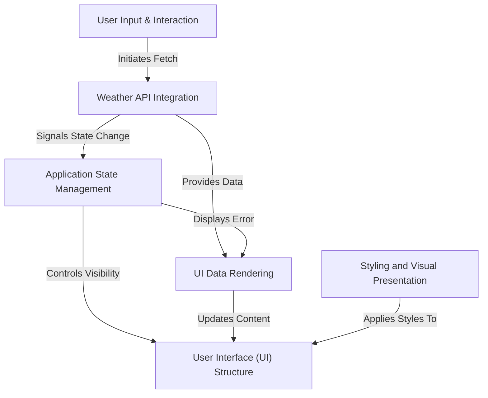

# Tutorial: Weather_APP

This project is a **simple web application** that allows users to *search for weather information* in any city. It communicates with an external API to fetch up-to-date weather data, then *beautifully displays* details like temperature, humidity, and wind. The app provides clear feedback to the user, showing a *loading state* during data retrieval and *error messages* if something goes wrong.

## Visual Overview

## Chapters

1. [User Interface (UI) Structure
](01_user_interface__ui__structure_.md)
2. [Styling and Visual Presentation
](02_styling_and_visual_presentation_.md)
3. [User Input & Interaction
](03_user_input___interaction_.md)
4. [Weather API Integration
](04_weather_api_integration_.md)
5. [Application State Management
](05_application_state_management_.md)
6. [UI Data Rendering
](06_ui_data_rendering_.md)

---
